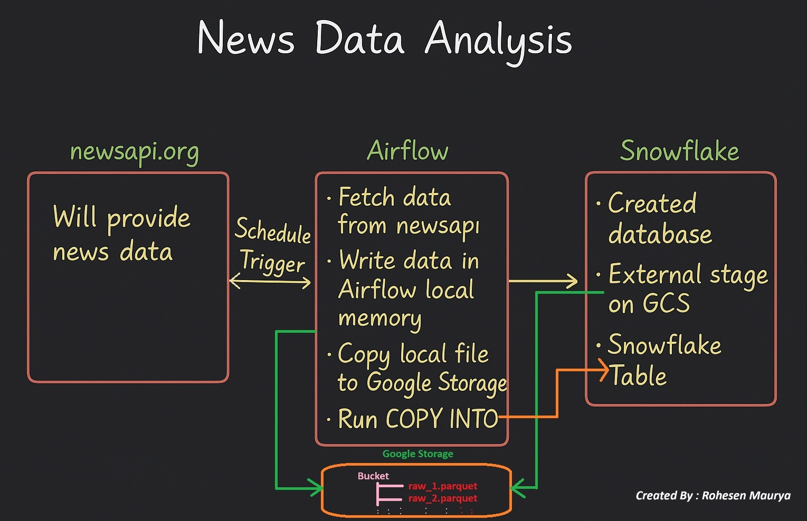

# 📰 News Data Analysis with Airflow, GCS & Snowflake

## 📌 Project Overview

This project automates the process of fetching **news articles** from [NewsAPI](https://newsapi.org), storing them in **Google Cloud Storage (GCS)**, and incrementally loading them into **Snowflake** for analysis.
The pipeline is orchestrated using **Apache Airflow** and creates useful **summary tables** for news source statistics and author activity.

## 🏗️ Project Architecture

This project automates the flow of **news data** from the API to analytics-ready tables in Snowflake.




### 🔹 Step 1: NewsAPI (Data Source)

* We use **newsapi.org** to fetch the latest news articles.
* Each article includes details like title, author, source, content, published date, etc.

---

### 🔹 Step 2: Airflow (Workflow Orchestration)

* Airflow is used to **schedule and run tasks daily**.
* The DAG performs the following steps:

  1. Fetch news data from NewsAPI.
  2. Save the data into **Parquet files** (efficient storage format).
  3. Upload these files to **Google Cloud Storage (GCS)**.
  4. Trigger Snowflake to load and process the data.

---

### 🔹 Step 3: Google Cloud Storage (Data Lake)

* GCS acts as a **temporary data lake**.
* All parquet files (`raw_1.parquet`, `raw_2.parquet`, …) are stored here.
* Snowflake reads directly from this bucket.

---

### 🔹 Step 4: Snowflake (Data Warehouse)

* Snowflake connects to GCS through a **storage integration** and **external stage**.
* Data is loaded into a **raw table** (`news_api_data`).
* Two summary tables are created for analysis:

  * **`summary_news`** → groups news by source with counts and date ranges.
  * **`author_activity`** → shows author activity with article counts and distinct sources.

---

### 🔹 End Result

* A fully automated **ETL pipeline**:

  * **Extract** → NewsAPI
  * **Load** → GCS (Parquet files)
  * **Transform** → Snowflake (summary tables)

This allows you to answer questions like:

* Which source published the most articles?
* Who are the most active authors?
* What is the time range of articles per source?

---

## ⚙️ Tech Stack

* **Airflow** → Orchestration of the ETL pipeline
* **Python** → API extraction & data transformation
* **Google Cloud Storage (GCS)** → Storage for raw parquet files
* **Snowflake** → Data warehouse for querying & analytics
* **NewsAPI** → Source of news articles

---

## 📂 Project Structure

```
.
├── fetch_news.py              # Python script to fetch news from NewsAPI and upload to GCS
├── news_api_airflow_job.py    # Airflow DAG definition
├── requirements.txt           # Python dependencies
└── README.md                  # Project documentation
```

---

## 🔑 Workflow

### 1. **Fetch Data**

* Uses `fetch_news.py` to:

  * Call NewsAPI (`/v2/everything`) for yesterday → today’s news.
  * Extract metadata (title, author, timestamp, source, content, image).
  * Save results as a **Parquet file**.
  * Upload parquet file to GCS bucket.

### 2. **Airflow Orchestration**

* The DAG (`news_api_airflow_job.py`) schedules daily pipeline runs.
* Tasks:

  1. **Fetch news → upload parquet to GCS**
  2. **Create Snowflake table** (schema inferred from parquet)
  3. **Load parquet from GCS stage → Snowflake table**
  4. **Build summary tables**:

     * `summary_news` → article counts by source
     * `author_activity` → author activity across sources

### 3. **Snowflake Setup**

1. Create database:

   ```sql
   CREATE DATABASE news_api;
   USE news_api;
   ```
2. Define file format:

   ```sql
   CREATE FILE FORMAT parquet_format TYPE=parquet;
   ```
3. Create storage integration with GCS:

   ```sql
   CREATE OR REPLACE STORAGE INTEGRATION news_data_gcs_integration
   TYPE = EXTERNAL_STAGE
   STORAGE_PROVIDER = GCS
   ENABLED = TRUE
   STORAGE_ALLOWED_LOCATIONS = ('gcs://<your-bucket>/news_data_analysis/parquet_files/');
   ```
4. Get service account via:

   ```sql
   DESC INTEGRATION news_data_gcs_integration;
   ```

   → Grant that Snowflake service account `Storage Object Viewer` access in GCS.
5. Create external stage:

   ```sql
   CREATE OR REPLACE STAGE gcs_raw_data_stage
   URL = 'gcs://<your-bucket>/news_data_analysis/parquet_files/'
   STORAGE_INTEGRATION = news_data_gcs_integration
   FILE_FORMAT = (TYPE = 'PARQUET');
   ```

---

## 🛠️ Setup Instructions

### Prerequisites

* Python 3.8+
* Google Cloud project with a bucket created
* Snowflake account
* NewsAPI account (get an API key)
* Airflow installed & running

### Installation

1. Clone repo:

   ```bash
   git clone https://github.com/<your-username>/news-data-pipeline.git
   cd news-data-pipeline
   ```
2. Install dependencies:

   ```bash
   pip install -r requirements.txt
   ```
3. Configure **Google Cloud credentials**:

   ```bash
   export GOOGLE_APPLICATION_CREDENTIALS="/path/to/service-account.json"
   ```
4. Set **Airflow connection for Snowflake**:

   ```bash
   airflow connections add 'snowflake_conn' \
   --conn-type 'snowflake' \
   --conn-login '<USERNAME>' \
   --conn-password '<PASSWORD>' \
   --conn-host '<ACCOUNT>.snowflakecomputing.com' \
   --conn-schema 'PUBLIC' \
   --conn-extra '{"warehouse": "<WAREHOUSE>", "database": "NEWS_API"}'
   ```

---

## ▶️ Running the Pipeline

* Trigger DAG manually:

  ```bash
  airflow dags trigger newsapi_to_gcs
  ```
* Or let Airflow schedule it (daily).

---

## 📊 Outputs

1. **Raw Table:**
   `news_api.PUBLIC.news_api_data` → contains raw article data from parquet files.

2. **Summary Tables:**

   * `summary_news` → news source statistics

     ```sql
     SELECT * FROM news_api.PUBLIC.summary_news;
     ```
   * `author_activity` → author activity stats

     ```sql
     SELECT * FROM news_api.PUBLIC.author_activity;
     ```

---

## 📈 Example Analytics

* Top 10 news sources by article count
* Active authors with the widest reach (most distinct sources)
* Trends in publication dates

---

## 🚀 Future Improvements

* Support multiple keywords (instead of just `"apple"`)
* Add incremental watermarking (avoid duplicates)
* Deploy with **Dockerized Airflow**
* Automate via **CI/CD (GitHub Actions + dbt for transformations)**

---

## 👨‍💻 Author

Built by **Rohesen Maurya**
